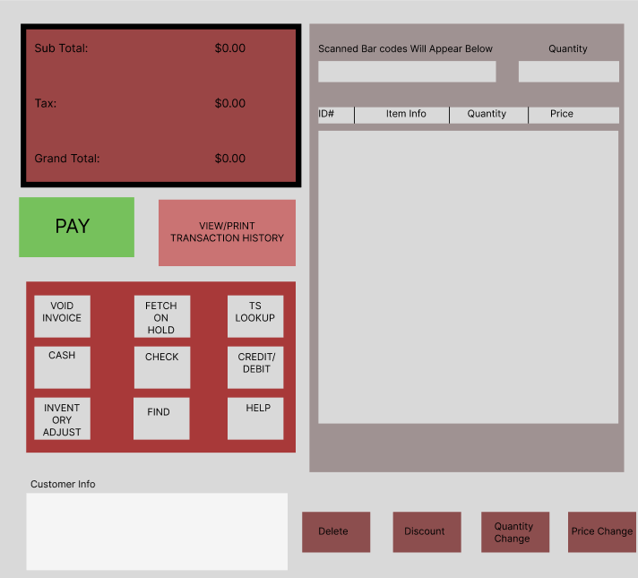
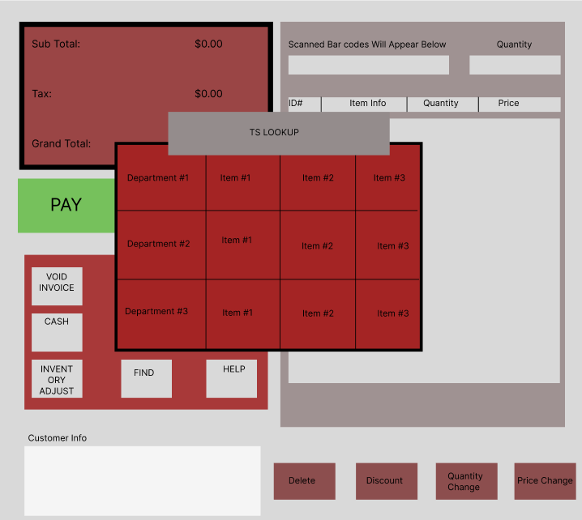
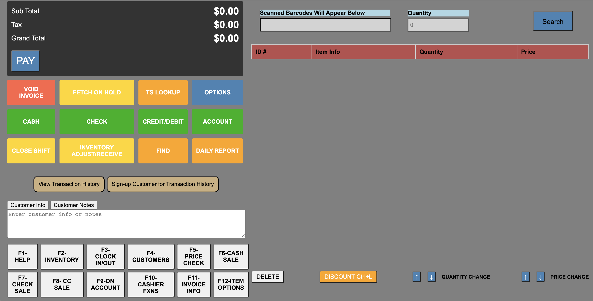

# UI Design

## Wireframe

Main page of POS web application user interface

The above wireframe interface was created using figma online software tool. We are building a POS system web application. The top left icon colored grey displays the total accumulated price excluding tax, the tax, and the grand total price including tax. The PAY button below enables the client to make a purchase. Clicking on this icon will provide additional payment options. The view/print transaction history icon is used to fetch a record of a known customer's transaction history, with the option to print or display on the screen. The next nine options are customizable. Void invoice is used to clear all the items currently rung up and restart. Fetch on hold is used to save all items currently rung up for a customer to be added instantly back when needed. TS Lookup is used to manually search through all items in the database sorted by department. The next options specify different methods of payment which include debit, credit, etc. On the right side the barcode of a scanned or manually added item will appear, along with the quantity of that item. All rung up items will show up in the table below as a separate row. There are options below the table for deleting an item or changing the quantity.

TS Lookup Page for viewing all items registered in database

This page will appear when the client clicks on TS Lookup. It displays all the items in the database associated with a particular store. The items are sorted by department. These categories can be chosen by the client, and the client has the ability to add, edit, or remove items that show up in this window. The TS lookup window overlaps with the main page and can be closed by clicking on the X button in the top right corner.

## Stories

### Story 1 Pay by cash and giving change

Chad, a cashier at a local convience store is ringing up a customer who's total added up to be $7.75. The customer gives Chad a $20 bill. Chad will click on the pay option and will be prompted to type in the payment amount, 20. Chad will be able to see how much change he will have to give back to the customer. 

### Story 2 Daily Report

It was the day before Thanksgiving and the local convinece store was really busy. The store manager, Mary, is about to close the store and needs to take record of how much in sales they did. Mary clicks on the Daily Report button and at the top of the page, she is able to see how much in sales the store did that day.  

### Story 3 - Inventory Adjust/Receive

As a store manager, Mary was responsilbe for managing the inventory levels of the convenience store she worked at. Mary had just received a shipment of the stores most famous product, Blue Powerade, and knew that she had to update the inventory as the product was running low. Once on the POS application Maria click's on the "Inventory Adjust/Receive" button. After this she is brought to a separte web page where she could either lookup the item by search or barcode. After finding the product she would click on it and then adjust the quantity accordingly. To adjust the quantity she would click on the increase button and then type in the quantity of the shipment received.To save her changes she would click "Submit" and this would change the inventory accordingly.

### Story 4 - Clock In / Clock Out

Aubrey is a hardworking high-school student who has a part-time job at the local convenience store. Eveytime before he starts to work he has to clock in and after his shift ends he has to clock out. To do this, when he want to clock in he click on the "Clock In/Out" button on the mainpage of the POS application. It would then take him to a separte web page where he would be prompted to enter his employee ID. Then he would be taken to another web page where he could either select "Clock In" or "Clock Out". The "Clock Out" option would be grayed out if he hasn't clocked in yet. Below these options he could also find the total amount of time since he clocked in if he had done that. Initially he would select "Clock In" and at the end of the shift would select "Clock Out".

## HTML & CSS Mockup

Main page of POS web application user interface

The interface was implemented using HTML, CSS, and JavaScript. It contains a general layout of the interface with some functionality. The interface closely resembles the wireframes, except for the some differences in the styling and size of certain elements. Additional buttons were added to give the client more controls to change the quantity and price of elements. There are also some hotkeys provided to expediate certain tasks such as adjusting prices or ringing up items.

## References

- [Link 1](https://example.com)
- [Link 2](https://example.com)
- [Link 3](https://example.com)
